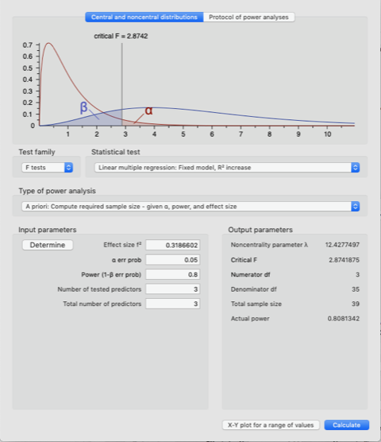
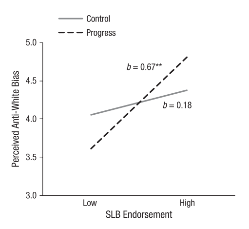

<!-- Replication reports should all use this template to standardize reporting across projects.  These reports will be public supplementary materials that accompany the summary report(s) of the aggregate results. -->

##Introduction

###Original Paper
[Wilkins, C. L., & Kaiser, C. R. (2014). Racial progress as threat to the status hierarchy: Implications for perceptions of anti-White bias. *Psychological Science, 25*(2). https://doi.org/10.1177/0956797613508412](https://github.com/ecreinhart/wilkins2014/tree/master/original_paper)

###Repository
[Wilkins & Kaiser (2014) study 2 replication](https://github.com/ecreinhart/wilkins2014)

###Online survey
[Preview Qualtrics survey]("https://stanforduniversity.ca1.qualtrics.com/jfe/preview/SV_eyvQlTXQhqikcND?Q_SurveyVersionID=current&Q_CHL=preview")

##Introduction
Wilkins and Kaiser (2014) tested the effect of minority racial progress on perceptions of anti-White bias among White participants. In study two, the authors manipulated minority racial progress and found that status-legitimizing beliefs (SLB) moderate the effect of minority racial progress on perceptions of anti-White discrimination. In particular, participants who strongly endorse SLB and were randomly assigned to read an article about minority racial progress cited significantly more anti-White bias than high-SLB participants in the control condition. The focus of the current project is to replicate the finding in which high-SLBs moderate the effect of minority racial progress on perceptions of anti-White discrimination.  


##Methods

White participants will be recruited from Amazon Mechanical Turk and randomly assigned to one of two conditions: racial progress or control. In the racial progress condition, participants will read a news article about racial minorities in high-status positions. In the control condition, participants will read a news article about a low-ranked swim team winning a championship. After reading the article, participants will complete measures of racial progress, system-legitimizing beliefs, anti-White bias, and demographics. Wilkins posted the racial progress and control news articles on her personal website along with the exact wording and formatting of the measures used in the study (see research materials on [Wilkins' website](https://sites.wustl.edu/spia/research-materials/) or in the [replication repository](https://github.com/ecreinhart/wilkins2014/tree/master/original_paper)), which will allow for a very close replication. 

###Power Analysis

The paper cites the original effect size as b = 0.49. When converted, the effect size is d = 1.1289, f = .5645, and f^2 = 0.31866025. The regression model testing the interaction of SLB x condition has three predictors (condition, SLB, and condition x SLB). Setting alpha = .05 yields the following samples:

 

80% power: 39 </br>
90% power: 49 </br>
95% power: 58 </br>

The large effect size allows a relatively small and feasible sample to have 80% power. 

###Planned Sample

39 White Americans (above 18 years of age) were recruited using Turk Prime to target only White Mechanical Turk workers. 

Exclusion criteria were set based on Dr. Wilkins' instructions on exclusion criteria.

"We excluded data from people who failed attention checks. For example, we asked:
'Verify that you are reading carefully by selecting strongly agree.' - which was embedded in the SLB measures and 'Do not select any response for this question' embedded in anti-White bias measures.""

###Materials

The materials described in the original paper or as described in detail on [Wilkins' website](https://sites.wustl.edu/spia/research-materials/) were followed precisely unless otherwise noted. 

As stated in the original paper, "All items were rated using scales from 1 (strongly disagree) to 7 (strongly agree)."

####Manipulation

The replication used the exact wording of the two articles in the original with three exceptions. The publication date of each article was changed from 2009 to 2018. The date cited as the time by which race will no longer be a marker of social status in the U.S. (in the treatment condition article) was changed from 2020 to 2030. The date by which the swim team was said to compete in the Olympics (in the control condition article) was changed from 2012 to 2020. 

Participants answered the same follow-up distractor questions as used in the original paper after reading the article. Find the follow-up questions on the original materials posted on [Wilkins' website](https://sites.wustl.edu/spia/research-materials/). 

####Racial progress manipulation check 
An item measuring participants’ agreement with the statement “Blacks in the U.S. are better off now (financially, politically, etc.) than they ever have been."" served as the manipulation check. 

####Status-legitimizing beliefs

"Participants completed Levin, Sidanius, Rabinowitz, and Federico’s (1998) 12-item SLB measure, which assesses individuals’ beliefs regarding system legitimacy, or the perception that the system is fair (example item: “America is a just society where differences in status between ethnic groups reflect actual group differences”); system permeability, or the perception that all individuals, regardless of ethnicity, can achieve social advancement (example item: “America is an open society where individuals of any ethnicity can achieve higher status”); and Protestant work ethic, or the idea that hard work is rewarded (example item: “If people work hard they almost always get what they want”). We averaged these items and used the composite score in our analyses because the separate subscales functioned similarly across analyses (also see O’Brien & Major, 2005). Together, our SLB items assess the extent to which individuals believe that the system is fair and legitimate."

####Perceptions of anti-White bias 

"We used eight items to assess perceptions of anti-White bias: (a) “Prejudice and discrimination against Whites are on the rise,” (b) “Whites are victims of racial bias,” (c) “Whites do not experience racism” (reverse-scored), (d) “Whites experience discrimination from Blacks,” (e) “Whites experience discrimination from other Whites,” (f) “Blacks and other racial groups benefit from preferential treatment that disadvantages Whites,” (g) “Reverse racism (where racial minorities are favored over Whites) is pervasive,” and (h) “Only racial minorities experience negative outcomes based on their race” (reverse-scored)."

###Procedure	

The procedures described in the original articled were followed precisely. "Participants were told that they would be participating in two separate studies. The “first study” was described as an examination of reactions to news articles. Participants were randomly assigned to read one of two articles. In the racial-progress condition, participants read about high-status racial minorities in traditionally White positions (e.g., Barack Obama, Condoleezza Rice) and further read that social mobility is generalized to racial minorities in the United States (e.g., progress in college enrollment and income). In the control condition, participants read about an underdog swim team winning the national championship. This control article mirrored the racial-progress article in that it was about a low-status group becoming a higher-status group. Participants completed questions that tested their memory of the articles. The “second study” was described as an examination of perceptions of society. This portion of the procedure contained the measure of anti-White bias and a manipulation check." "Participants then reported their endorsement of SLBs and demographic information."

Demographic infomration will include gender, age, and race/ethnicity to check recruiting efforts of White participants.  

###Analysis Plan

"Participants who randomly clicked through the survey were removed." 

"Mean-centered SLB scores and condition (0 = control, 1 = racial progress) were entered in Step 1 of a hierarchical linear regression. The two-way interaction between SLB and condition was entered in Step 2. In order to examine whether there were differences between conditions for individuals high and low in SLB endorsement, we tested the effects of condition for participants whose levels of SLB endorsement were high (1 SD above the centered mean) and low (1 SD below the centered mean; Cohen et al., 2003). Additionally, we examined simple slopes to determine whether SLB endorsement was related to anti-White bias within each condition."

**The key analysis of interest is testing an interaction between status-legitimizing beliefs (SLB) and condition on perceptions of anti-White bias.**

To test whether the manipulation was effective, a t-test was also conducted for condition differences in perceptions of racial progress. 

###Differences from Original Study

The sample, materials, and procedure exactly match the original study. One important difference is that the sociopolitical culture has changed since the original data was collected in 2009. Hate crimes rates in the United States have risen in recent years ([see BBC report on the increase](https://www.bbc.com/news/world-us-canada-41975573) and [FBI hate crime data](https://ucr.fbi.gov/hate-crime/2016)). I predict that increased racial tension in the United States will lead White American participants to feel more status threat, such that participants with high-SLB will cite more anti-White bias after reading about racial progress (i.e., the effect will be stronger). 

<!-- ### Methods Addendum (Post Data Collection)

You can comment this section out prior to final report with data collection. 

#### Actual Sample
  Sample size, demographics, data exclusions based on rules spelled out in analysis plan

#### Differences from pre-data collection methods plan
  Any differences from what was described as the original plan, or “none”. !-->


##Results


### Data preparation

Data preparation following the analysis plan. 
	
```{r}
###Data Preparation

#load pacakges 
library(tidyverse)
library(psych)
library(ggthemes)
char = as.character
num = function(x) {return (as.numeric(char(x)))}
ci <- function(x) {sem(x) * 1.96} # reasonable approximation 
sem <- function(x) {sd(x, na.rm=TRUE) / sqrt(sum(!is.na((x))))}

#import anonymized data from Qualtrics, numeric values
wilkins2014_raw <- read.csv("../data/wilkins & kaiser 2014 replication_December 4, 2018_23.03_anonymized.csv") 

#remove first two rows that are headers and the first 31 rows (through row 33) which are previews 
wilkins2014_formatted <- wilkins2014_raw[-(1:50),] %>% 
  select(slb_1:slb_12,awb_1:awb_8,condition,rac_prog,race,attn_check_1,attn_check_2,separate) #select variables of interest 

#### Data exclusion / filtering  

#exclusions
wilkins2014_excluded <- wilkins2014_formatted %>% 
  filter(race == 5, #filter White participants only 
         attn_check_1 == 7, #select if followed attn check instructing to select "7, strongly agree"
        attn_check_2 == "") %>% #select if followed attn check instructing to not select a value 
  rowid_to_column("ID")  #add arbitrary participant ID

#tidy and change to numeric variables 
wilkins2014_gathered = wilkins2014_excluded %>% 
  select(ID,starts_with("slb_"),starts_with("awb_"),rac_prog,condition) %>% #select variables of interest 
  gather("measurement", "value", 
         -ID, -condition, -rac_prog) %>% 
  mutate(value = num(value)) %>% 
  separate (measurement,c("scale","item"), sep="_")

#reverse score anti-White bias (3, 8) and SLB (3, 4, 7, 8, 11, 12); composite each 
wilkins2014_reverse_coded <- wilkins2014_gathered %>%  
  mutate(value = ifelse(scale == "awb" & item %in% c(3, 8),
                        8- value,
                        value)) %>% 
  mutate(value = ifelse(scale == "slb" & item %in% c(3, 4, 7, 8, 11, 12),
                        8- value,
                        value))

wilkins2014_composites = wilkins2014_reverse_coded %>% 
  group_by(condition, ID, scale) %>% 
  summarize(composite = mean(value)) %>%
  ungroup()

wilkins2014_spread = wilkins2014_composites %>% 
  spread(scale,composite)

wilkins2014_centered = wilkins2014_spread %>% 
  mutate(slb_centered = (scale(slb, center = TRUE, scale = FALSE)))

```

### Confirmatory analysis

The analyses as specified in the analysis plan. 

"Mean-centered SLB scores and condition (0 = control, 1 = racial progress) were entered in Step 1 of a hierarchical linear regression. The two-way interaction between SLB and condition was entered in Step 2. In order to examine whether there were differences between conditions for individuals high and low in SLB endorsement, we tested the effects of condition for participants whose levels of SLB endorsement were high (1 SD above the centered mean) and low (1 SD below the centered mean; Cohen et al., 2003). Additionally, we examined simple slopes to determine whether SLB endorsement was related to anti-White bias within each condition."

```{r}
#linear regression of condition*SLB interaction
model <- lm(awb ~ condition + slb_centered + condition*slb_centered, data=wilkins2014_centered)
summary(model) 

#calculate condition*SLB coefficient 
model_coefs = summary(model)$coefficients
model_coefs["conditiontreatment:slb_centered", "t value"]

```


```{r}
#plot of condition*SLB interaction

most_extreme_x_value = 1.15*max(abs(wilkins2014_centered$slb_centered))

interaction_plot <- wilkins2014_centered %>% 
  ggplot() +
  aes(x = slb_centered, y = awb, color = condition, linetype = condition) +
  xlim(-most_extreme_x_value,most_extreme_x_value) +
  ylim(0,7.5) +
  geom_smooth(method="lm", se=FALSE) +
  theme_few()+
  scale_color_grey()+
  xlab("SLB Endorsement")+
  ylab("Perceived Anti-White Bias")
interaction_plot
ggsave("interaction_plot.png", width=4, height=3)
  
```




###Exploratory analyses

Any follow-up analyses desired (not required).  
```{r}
#prep data for manipulation of condition on racial progress
wilkins2014_manip_check <- wilkins2014_excluded %>% 
  mutate(condition.n = ifelse(condition == "control",
                              0,
                              1)) %>% 
   mutate(rac_prog = num(rac_prog))

#manipulation check of condition on racial progress
manip_check <- t.test(wilkins2014_manip_check$rac_prog ~ wilkins2014_manip_check$condition.n)
print(manip_check)

#data prep for racial progress manipulation check plot 
manip_check_plot_data <- wilkins2014_manip_check %>% 
  select(ID,rac_prog,condition,rac_prog) %>% 
  group_by(condition) %>% 
  summarize(rac_prog_avg = mean(rac_prog),
            ci=ci(rac_prog),
            n=n()) 

#plot manipulation check 
manp_check_plot <- manip_check_plot_data %>% 
  ggplot(aes(x=condition, y=rac_prog_avg)) +
  geom_bar(position = "dodge", stat = "identity") +
  geom_errorbar(aes(ymin = rac_prog_avg - ci, 
                    ymax = rac_prog_avg + ci), 
                    width=.2,
                    position=position_dodge(.9)) +
  xlab("Condition") + 
  ylab("Racial Progress") +
  theme_few()
manp_check_plot
ggsave("manip_check_plot.png", width = 4, height = 3)

```

```{r}

#prep data for check on condition differences in believing separate studies
wilkins2014_separate_check <- wilkins2014_excluded %>% 
  mutate(condition.n = ifelse(condition == "control",
                              0,
                              1)) %>% 
   mutate(separate = num(separate))

#check on condition differences in believing separate studies
separate_check <- t.test(wilkins2014_separate_check$separate ~ wilkins2014_separate_check$condition.n)
print(separate_check)

#plot separate studies check 
separate_check_plot_data <- wilkins2014_separate_check %>% 
  select(ID,separate,condition,separate) %>% 
  group_by(condition) %>% 
  summarize(separate_avg = mean(separate),
            ci=ci(separate),
            n=n()) 

separate_check_plot <- separate_check_plot_data %>% 
  ggplot(aes(x=condition, y=separate_avg)) +
  geom_bar(position = "dodge", stat = "identity") +
  geom_errorbar(aes(ymin = separate_avg - ci, 
                    ymax = separate_avg + ci), 
                    width=.2,
                    position=position_dodge(.9)) +
  xlab("Condition") + 
  ylab("Agree Separate Studies") +
  theme_few()
separate_check_plot
ggsave("separate_check_plot.png", width = 4, height = 3)

```

```{r}

#compare overall AWB scores to mean reported in original paper: "Perceptions of anti-White discrimination (α = .85; M = 4.21, SD = 1.12)"

AWB_mean = mean(wilkins2014_spread$awb, na.rm = TRUE)
AWB_sd = SD(wilkins2014_spread$awb, na.rm = TRUE)
print(AWB_mean)
print(AWB_sd)

```


## Discussion

### Summary of Replication Attempt

Open the discussion section with a paragraph summarizing the primary result from the confirmatory analysis and the assessment of whether it replicated, partially replicated, or failed to replicate the original result.  

### Commentary

Add open-ended commentary (if any) reflecting (a) insights from follow-up exploratory analysis, (b) assessment of the meaning of the replication (or not) - e.g., for a failure to replicate, are the differences between original and present study ones that definitely, plausibly, or are unlikely to have been moderators of the result, and (c) discussion of any objections or challenges raised by the current and original authors about the replication attempt.  None of these need to be long.
